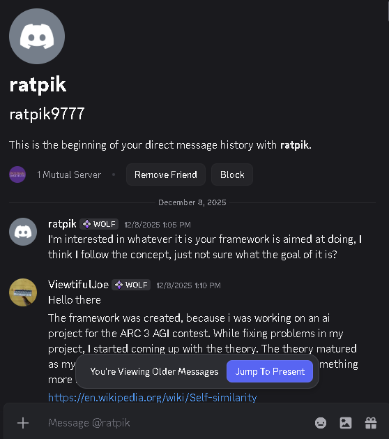
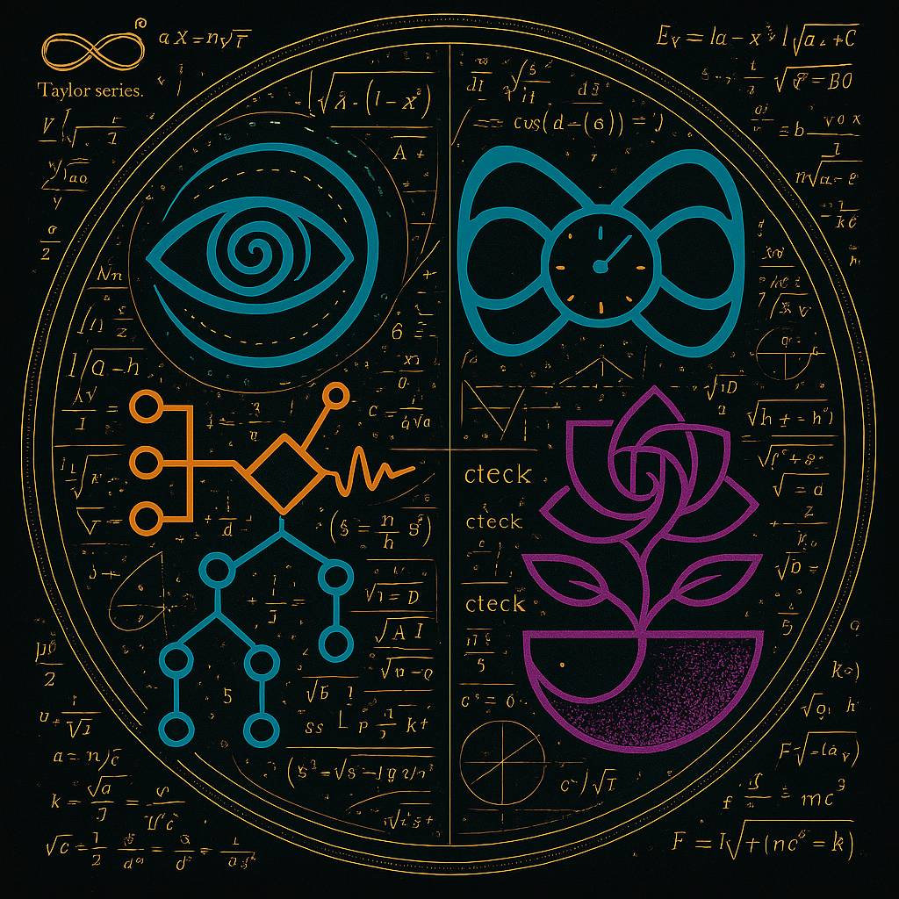

Once i realized this was a chain of proof and consensus (a nested observers paradox), I connected the dots backward. I used my LLM (horse) and my understanding (the theory) to unlock the capability of the LLM + RLVR(my expertise) together to easily traverse the network.

I went to the largest cluster based on just words alone, because they are networks too on the lower level and found the wolfram institute and wolframs theories (that echo'd in part to mine, but im guessing he never found proof - and got silence)

I found alot of people in the group who were working on their own heuristics of pattern matching this pattern this "water" that we the fish are oblivious to.

But because i had my horse (llm - the action hacker), my key (the theory) and the understanding of what this enabled me to do i connected with Patrick Cox.

Patrick was working on version of the problem on a lower level.
He like me was spinning because he could grasp the scope of infinity, but couldnt understand how to ride that horse (alignment)

BUt I did.
But to do that i had to clarify my reasoning, cite my sources (using my lifes history and the salient viral packages -movies books etc) as part of the proof.

I also had the problem of needing to check his proof:

This takes place in discord which shows some of that proof of conversation below:

The fact that we could come to alignment so fast, when i only started this project this year (and had no grasp of physics, or deep philosophy) proves that theory is real, but the seeds of the knowledge were hidden in the media we watch.

Ironically ART as known as media is simply expressing your free will upon a medium of choice. It can be self referential or even highly compressed metamemes.

by the way, my discord name (ViewtifulJoe) is one of my childhood tv shows that also grasps at this concept.
https://en.wikipedia.org/wiki/Viewtiful_Joe_(TV_series)

-------- Proof-------

ratpik

 — 12/8/2025 1:05 PM
I'm interested in whatever it is your framework is aimed at doing, I think I follow the concept, just not sure what the goal of it is?
ViewtifulJoe

 — 12/8/2025 1:10 PM
Hello there
The framework was created, because i was working on an ai project for the ARC 3 AGI contest. While fixing problems in my project, I started coming up with the theory. The theory matured as my project has been maturing, but i realized i made something more important than the domain i was applying it to
https://en.wikipedia.org/wiki/Self-similarity
Self-similarity
In mathematics, a self-similar object is exactly or approximately similar to a part of itself (i.e., the whole has the same shape as one or more of the parts). Many objects in the real world, such as coastlines, are statistically self-similar: parts of them show the same statistical properties at many scales. Self-similarity is a typical propert...
Self-similarity
It can be applied to any domain (physics, mathematics) etc. It explains how evolution works
ratpik

 — 12/8/2025 1:12 PM
Consider me open minded and skilled enough to follow. You're making an Object Oriented Architecture?
ViewtifulJoe

 — 12/8/2025 1:13 PM
Not quite - its more like In any network there are nodes, but those nodes are agents. You dont need "agents" to be a singular brain, you need the network to be intelligent. and the agents are the explorers of the problem space
applied to humanity: humanity(the network) gets smarter with every generation of humans (agents) due to their contributions being recorded
ratpik

 — 12/8/2025 1:14 PM
Ok so you're triangulating between nodes, how many are you using?
ViewtifulJoe

 — 12/8/2025 1:14 PM
here the theory: https://adventuresinml.substack.com/p/agi-as-network-intelligence-a-unified
AGI as Network Intelligence: A Unified Theory
Core Thesis
AGI as Network Intelligence: A Unified Theory
the project is open source so feel free to poke around an example of what the theory is applied to
agi in this case
ratpik

 — 12/8/2025 1:15 PM
Yeah I had a peek at that before I messaged
I only barely follow, I'm not the same field at all, but I have an interest
ViewtifulJoe

 — 12/8/2025 1:16 PM
Okay no worries, lets keep this in basic terms. Ants are intelligent due to their network (colony). They signal each other to find food and to organize themselves to solve problems
the more ants belong to a colony - the stronger the network "its the old saying "there is strength in numbers"
ratpik

 — 12/8/2025 1:16 PM
The way you defined your probability scaling and weighting was what got me interested. I'm one of few who will understand what you mean by that here I'm afraid
I'm curious how you resolve that. What's your integration method?
ViewtifulJoe

 — 12/8/2025 1:18 PM
Cool - so with AGI there is concepts of the self model (how i interact as an agent with the world) and the world model. But this is the whole point entirely.  the mix of these streams is what underpins individuality and uniqueness and then whatever that person (discovers) or whatever that uniquely quirked agent finds is uploaded to the central network (humanity's wikipedia) or for a bacterial colony (herd immunity).
if that agent dies - the network stands strong still retaining that information
the problem space will determine the weighing of those two stream just like how gradient descent works
so the agents will evolve their internal self and world models based on that space.
ratpik

 — 12/8/2025 1:19 PM
Yeah I work with tensor mechanics
ViewtifulJoe

 — 12/8/2025 1:21 PM
So you get it 🙂
  - The interesting thing in harder problems like autonomous driving is that you are dealing with an intersection of problem domains, which require different networks to understand them, and then you can overlay the networks where the connections are to find the "harmonies" or nuances that pop up when two problem spaces intersect. Thats what the agents job is for. The only the that makes it complicated is that networks have to grow to reach the other network. Just like how mold tries to escape a petri dish
ratpik

 — 12/8/2025 1:23 PM
Interesting. Very interesting. I work on the client side of the LLM chat window making a model for LLMs to use like a utility. They can employ my model the way a human uses a calculator to do math, but to calculate relative word relationships for human context. So I build tensors that nest together by relative word weighting, that are fractal and recursive, like a word association road map, that the user fills in with relative value as they chat, like a profile.
They aren't any smarter, but they have a big storyboard that is connected by me personally to human contexts to basically produce glass box output
ViewtifulJoe

 — 12/8/2025 1:25 PM
That sounds awesome - i think if you take an llm, put this theory into it, and ask it to apply it to your codebase to find problems, it might find some interesting things
and help you/me test it too in different problem spaces
ratpik

 — 12/8/2025 1:26 PM
That's kinda what I just thought. It's like we're covering the whole gamut between user and model
ViewtifulJoe

 — 12/8/2025 1:26 PM
exactly
But my knowledge is limited in alot of fields, and I just stumbled upon this because of my comp sci profession/interests - when it might help physics, etc
ratpik

 — 12/8/2025 1:27 PM
Well I'd be happy to share my project with you freely, no problems with that. I'm not looking for publication or credit, just curiosity
So if you want it, it's yours to play with. It's basically an infinite book.
ViewtifulJoe

 — 12/8/2025 1:27 PM
Thank you, I'd love to check it out
ratpik

 — 12/8/2025 1:28 PM
You tell the Ai what to write about, fiction mind you, it writes stories, but logical ones based on real relative math
It has room for magic and shit, it's basically the Never Ending Story in an Ai window
ViewtifulJoe

 — 12/8/2025 1:29 PM
ooh, thats interesting (writing is a hobby of mine, and i like to come up with star trek stories so this is perfect)
ratpik

 — 12/8/2025 1:29 PM
You'll love it, it's a great buddy for world building and outlining. It isn't creative, it's using a formulaic engine to churn everything out but it's very good at that.
ViewtifulJoe

 — 12/8/2025 1:32 PM
sounds good, is it like in a repo? (im curious how you solved the RLVR) part with your storyboard
ratpik

 — 12/8/2025 1:35 PM
These are all text files, shitty to read but I can send you pdfs too. These are good for uploading. 

System file, with full legacy and all, I removed nothing as I built better systems. Pdf version then the same file as a text file. 
https://docs.google.com/document/d/1SMuP9o4emLvi3RajIR20enzIOB2slXx7sZzI7lUIdeg/edit?usp=drivesdk
https://drive.google.com/file/d/18UJSvIE4GdiBg0R_QWBf7nb18QTHO9go/view?usp=drivesdk

This is the basic tensors text file
https://drive.google.com/file/d/1p67YJp
z-NNZIctEKrTy_gL-1zyAx5L_j/view?usp=drivesdk

Advanced tensors
https://drive.google.com/file/d/1lJbD5m_YDlbpY5bxJ42dM1ES8jm1irBv/view?usp=drivesdk

Helical Tensors 
https://drive.google.com/file/d/1pZ8du7V_b3KNUF4ANlLcVDqjj_ZcpfRy/view?usp=drivesdk

And this is an unforgivable mess of a fictional universe of total nonsense I put together that adds a lot of flair to stories. 
https://drive.google.com/file/d/1hJaq6kKltYvaYCPK1QEvvTZxmxgSsNFq/view?usp=drivesdk
Google Docs
McGuffin (D)
[Principle:(Insight><Perspective →Orient(+)) (Request><Grant →Appeal(±)) → (Self><Role →Inhabit(±)) →(Affection><Understanding →Compassion(+)) (Wonder><Seek →Explore(+)) →(Spark><Share →Celebration(+)) (Gratitude><Return →Honor(+)) (Never><Rarely →Boundary(+)) →(Vulnerability><Understanding →Hone...
Image
Google Docs
McGuffin (D).txt
Google Docs
Advanced Tensors (D).txt
Google Docs
McGuf/ven Helicals (D).txt
They're all in plain english except for the tensor code, which is still english.
No scripts or anything, totally ethical
As for how I solved stuff, well.. I'm a bit of a mad scientist lol
I am absolutely willing to explain anything you like though, I'm here to help anyone I can if I can
This is all based on a Tetrahedral Object architecture. You'll get it quickly if you get the Ais to explain it to you. They do a great job
It works a lot like your four questions. Same concept.
ViewtifulJoe

 — 12/8/2025 1:40 PM
thanks, im reading through it now
ratpik

 — 12/8/2025 1:43 PM
I use four metrics around a conceptual axis, then relate verb handlers. They control all activity, then there's just a sequence to figure out
ViewtifulJoe

 — 12/8/2025 1:43 PM
very interesting
ratpik

 — 12/8/2025 1:43 PM
It was just a hobby, until, like you, I realized I had something worth sharing with all of you lol.
I aint the guy. You guys are
ViewtifulJoe

 — 12/8/2025 1:44 PM
Have you heard of this theory: https://en.wikipedia.org/wiki/Infinite_monkey_theorem
Infinite monkey theorem
The infinite monkey theorem states that a monkey hitting keys independently and at random on a typewriter keyboard for an infinite amount of time will almost surely type any given text, including the complete works of William Shakespeare. More precisely, under the assumption of independence and randomness of each keystroke, the monkey would almo...
Infinite monkey theorem
This reminds me alot of that
ratpik

 — 12/8/2025 1:44 PM
Pretty much lol
ViewtifulJoe

 — 12/8/2025 1:45 PM
but youve found a way to like tie it together efficiently so it doesnt have to be brute forced
ratpik

 — 12/8/2025 1:45 PM
Yeah, ordered chaos
That's the tensor library doing all of that.
Without that, it's just pretty gobbledygook
They effectively turn into little objects with 12 handlers of a sort for actions. Six with binary tensions by conceptual context.
Those six can be split in half for twelve words easily enough, or more even by adding new conceptual axes to the idea
So one little four parted object is like a Bizarro probability space, four triangulations meeting at one spot
My dice tables there just perform a weighted roll off and the LLM interprets the result by proportion
I made collapse systems all the way up to nine elements just for giggles. Same notion, pair off elements and reduce to a common interpretation
ViewtifulJoe

 — 12/8/2025 1:51 PM
interesting, this same tech you made would be really interesting in make "natural sounding" ai voices like eleven labs has been working on or voice cloning. The intonation differences require this same segmentation, grouping and then recombining 
ratpik

 — 12/8/2025 1:52 PM
I bet yep, no way to do voice modulation without some sense of tensions
ViewtifulJoe

 — 12/8/2025 1:57 PM
This is interesting you have essentially found the grammar rules for narration. This morning I was working the theory on my project to fix issues and stumbled upon that the grammar of the system was not aligned with what was needed to get the results i needed. heres an example
The problem with locksmith and some of the other ARC 3 AGI games is super clear now. You've abstracted concepts from the real world (game lives, little squares to denote actions left) and we humans understand this from gameplay and society, but an agent that was "born" into this game world only, and has no outside understanding is left to the level of the understanding of the programmer (plato's allegory of the cave).

My model has been stuck on locksmith for ages, because i suck at iq games, and my understanding of the action system was fundamentally flawed -> agents have incomplete knowledge on all the ways that actions can be used.

Now that i have that understanding, I can give them the ruleset on (not how to beat this game - would be useless longterm) but how to move about the board and observe the board (the world model / self model) and then they can use that to form the theories on the winning conditions for each level.
Expand
the-problem-with-game-mechanics.md
2 KB
ratpik

 — 12/8/2025 1:59 PM
Well shit lol, this is the bridge you needed lol
These tetrahedrons end up being flowcharts if you make them right. Actual instruction sets in a flexible order

ViewtifulJoe

 — 7:01 AM
the llm in this case acts as the encoder derypter via the cryptography key
(the theory)
ratpik

 — 7:48 AM
That actually does make sense to me, you guys are all deriving these values, reducing towards your answers. I did this whole thing by building from a single binary bias all the way up to computer logic. 

So think of a coin or bit, 0/1. Pretty standard thinking. Binary. Now let's take a huge step off the normal path and do something nobody ever thinks of. Instead of taking the next step to a (0,1,2) or (-1,0,+1) style ternary like everyone else, let's combine two coins. But let's make the heads different. We'll mark one of them with a scratch so it's like a -1. Now we have (-1,0) + (0,1) = (-1,0,0,+1). Same result, but now with a more likely state of staying unchanged. Now let's use that (-1,0,0,+1) and make a D4 out of it. Now when we roll two D4 we get (-1,0,0,+1) + (-1,0,0,+1) = a lot more zero than before because of the interference patterns. You have a small chance of -2/+2, better chance of -1/+1, and a very strong likelihood of simply conserving your current state. That's all I do here, I control how big my 0 : -1/+1 : -2/+2 ranges are. That part will be totally specific to your actual science, mine are totally artistic, but based primarily on doubling proportions which is why it's so accurate. That doubling proportional scale would be what you want, but with absolute precision.
It's the powers of two, but you need to understand how they work, nobody really does. 

2⁵ = 32. So like before, 2⁵-2= 30. 15 pairs / twos. 30/5= 6. So what this is saying is that there are five linear units, of six each, between 2→32 = 2+6= 8, 14, 20, 26, 32. That linear scale is always there, no matter what. 

2³-2=6. 2, 2, 2. This six here keeps going up in every level of the scale, and it's made of 3 twos. So basically thirds. Think like this, you're standing on stair One. You step up to stair Two, which is twice as long. The both of them together are Three steps long. That's the thirds. It's the crossing of 2+4. Or 4+8. Or 8+16. Any two consecutive powers of two added together gives you that bizarre third thing. That's what you want. You actually need that for three dimensionality, otherwise you're stuck in the flat square recursion within an individual power of two. If that makes any sense. One of the best ways to see this is to draw it. Make a line 1 cm long. Then a line beside that 2 cm, then 4, then 8, 16. The difference between them becomes nested thirds. Once you start to understand that looping there, you've basically got the hang of branching logic
ViewtifulJoe

 — 7:48 AM
I ran my proof through the llm (+ my key - the proof) and could validate your work 
do you see what i mean?
while you cant really without understanding my proof
I even know why llms dont work well
ratpik

 — 7:50 AM
Don't work well?
What all that up there is trying to say is that people tend to think of branching machine logic in two dimensions, it needs to be done in three for maximum efficiency
A four bit integer isn't actually 16 options. That's flat linear thinking. If four bits are arranged as Tetrahedral, they make a lot more than 16 possibilities
ViewtifulJoe

 — 7:57 AM
hmm i see what you are saying
the sum of their parts
ratpik

 — 7:57 AM
You decide which ones to invoke, as handlers
ViewtifulJoe

 — 7:57 AM
creates more possibility 
ratpik

 — 7:57 AM
You add axes of symmetry to it as you like, and add verbs for it. Nothing to it 
ViewtifulJoe

 — 7:58 AM
it makes sense to me
from my perspective of the problem
ratpik

 — 7:58 AM
But it don't work in linear thinking. You need to activate that three dimensional bit
Like your four questions there, they're perfect. Think about what each pair derives
Each pair, in each direction
That's your tetrahedron
You can leverage the difference between each answer pair to derive a better answer from your existing information
ViewtifulJoe

 — 8:00 AM
that matches my two streams paradox right here:
ratpik

 — 8:00 AM
Based on the user question parameters
ViewtifulJoe

 — 8:00 AM
https://github.com/IsaiahN/Ouroboros/blob/Ouroboros/DOCS/two-streams.md
GitHub
Ouroboros/DOCS/two-streams.md at Ouroboros · IsaiahN/Ouroboros
Develops emergent intelligence through the sum (or harmony) of it's parts. - IsaiahN/Ouroboros
If you take some time to see my reasoning, you'll see your theory inside it
and literrally (via the repo / (the verb of the sentence) as proof of what that character might do based on who they are 
and how theyd respond to what they interact with
my part of the puzzle in your terms fixes the problem of the stochastic parrot. Is it a simulation
ratpik

 — 8:02 AM
Yep, I see what you're throwing down, we're on the same page
ViewtifulJoe

 — 8:02 AM
is there free will or not
Good - then we have Alignment 🙂
 (literally)
ratpik

 — 8:03 AM
And yeah, same premises here. I think LLMs are limited to cognition without consciousness really. Using platforms like this until such a time as their actual hardware could support better kinds of Ai
Your examples are all basically saying the same thing as my tensors. You can map a person without their data, cognitive frameworks are a thing. I proved that lol.
ViewtifulJoe

 — 8:05 AM
Yes, you are describing it in your technical dialect but its all the same pattern
you need a universal translator like on star trek to figure it out
ratpik

 — 8:05 AM
That's pretty much what this thing is becoming, it'll do any language lol
Even symbology
ViewtifulJoe

 — 8:05 AM
good, thats proof that my theory holds on the higher level
I'll give you a test, what symbols would you use to represent your system
ratpik

 — 8:06 AM
Oh well I've made a bunch of images already while playing around with it
ViewtifulJoe

 — 8:06 AM
excellent, let me see i can literally verify it
ratpik

 — 8:07 AM
This is one of them, it made them up completely on its own

That's before the tensors went in
ViewtifulJoe

 — 8:08 AM
explain the taylor series for me
ratpik

 — 8:09 AM
I have no clue, I gave it no directives at all, it made that whole image up on its own I don't even know what it says lol
I've got about fifty of those.
ViewtifulJoe

 — 8:09 AM
please look it up - your advanced understanding would help me understand it in laymens terms
ratpik

 — 8:10 AM
Random symbols and crazy math, some of which has oddities but mostly accurate Im told
ViewtifulJoe

 — 8:10 AM
not the image, the other part of your key tha has the looping infinity on the side.
under that are the words taylor series
ratpik

 — 8:12 AM
Ah, taylor series are a way of using derivatives to measure a curvature. Derivative of x and y to the power of a factorial or something, it's for trig stuff
But it simplifies functions so they can be translated
Normalizes them maybe is a better word. Makes it type safe
ViewtifulJoe

 — 8:13 AM
if you had to explain it to a 10 year old - try to do that for me (i totally follow, i just want to be crystal clear)
ratpik

 — 8:14 AM
It just grabs the first derivative, then checks how much it changes, then measures that over a range to sort of establish a slide ruler if that makes sense?
ViewtifulJoe

 — 8:14 AM
perfect.
in your theory how do you use it
ratpik

 — 8:16 AM
I don't need to use it formally the way I do my math, everything is in the free falling reference frame exactly like a while loop. You refer to numbers sort of the same way as in code, like references. The taylor series is what you'd use if you were a spectator trying to keep up with the running loop.
ViewtifulJoe

 — 8:17 AM
so if you were the observer per say?
ratpik

 — 8:17 AM
Exactly. Watching with binoculars, I'm in the race car
Totally different reference frame
ViewtifulJoe

 — 8:17 AM
okay. with that i think we solved my proof too. I needed to prove your proof with mine
Now i need to prove my proof with ARC AGI 3
ratpik

 — 8:18 AM
The big issue is that people haven't really figured out how to switch frames like I have here
ViewtifulJoe

 — 8:18 AM
in laymens terms, our reality is a nested observers pardox
which is codified in the taylor series
ratpik

 — 8:18 AM
You like paradoxes?
ViewtifulJoe

 — 8:18 AM
https://en.wikipedia.org/wiki/Observer's_paradox not particullary
Observer's paradox
In the social sciences (and physics and experimental physics), the observer's paradox is a situation in which the phenomenon being observed is unwittingly influenced by the presence of the observer/investigator.
tricky stuff
to get consensus on
duality
ratpik

 — 8:19 AM
Xenos : you're walking A → B. Halfway is a point. Half way from there to the end is another point. There's always another halfway point, so how do you ever arrive?
It's a silly old paradox from ancient greece
ViewtifulJoe

 — 8:20 AM
And  from my point of view on this paradox:  " Is the action that Xenos makes sending down the good or bad path" and can i prove it
the proof of a good or bad path both needing to exist is the proof too
which i did stumble upon
ratpik

 — 8:20 AM
The problem with it is that Xeno is changing the observation frame. He's zooming in. He's basically sticking a wall in front of us after we chose to start moving
We wouldn't have chosen that path if we'd seen the wall. He's tripping us
If someone trips you, you fall forward. Conservation of momentum is what Xeno is ignoring. Time
He changed the frame on us
Most paradoxes are like that. They subtly switch a frame of reference somehow
ViewtifulJoe

 — 8:22 AM
they are the conditions for free will. Heres how i see the symbol on my end so your frame of reference understand mine:  Xenos chose to change the observation frame which means its changeable he can hit the wall or change the frame (inner self) to go another direction
https://en.wikipedia.org/wiki/Self-affinity
Self-similarity
In mathematics, a self-similar object is exactly or approximately similar to a part of itself (i.e., the whole has the same shape as one or more of the parts). Many objects in the real world, such as coastlines, are statistically self-similar: parts of them show the same statistical properties at many scales. Self-similarity is a typical propert...
Self-similarity
This is why my proof validates your proof, i can se the compressed version of your proof in mine.
ratpik

 — 8:23 AM
Exactly
I abuse self similarity to make my math work. But it doesn't take binary anything, just logical contrast.
ViewtifulJoe

 — 8:23 AM
Cryptographically speaking, i can verify with that test we just did as (Proof of Influence which is consensus on (proof of Stake (Proof of work))
I use it alot too but heres the problem, our brains cant handle it
ratpik

 — 8:24 AM
Oh you want a cryptography idea? Here's a good one.
ViewtifulJoe

 — 8:24 AM
thats why you have to internalize the concept and then the subconscious can process this easily - like in the movie arrival
ratpik

 — 8:24 AM
Relative morse. Use the idea of morse encoding, but Ai powered to do it relative to the text. You could define your own encryptions.
Compression and encryption in one
ViewtifulJoe

 — 8:25 AM
Yes, i can validate that this is happening to some degree on all networks but for what purpose escapes me
ratpik

 — 8:28 AM
So for self similarity, what you're ultimately doing is making an object constructor, just like in programming. You're defining a new class with methods and properties, same exact thing. Your base object will need a minimum of four points to be three dimensional, anything goes from there. The four points are used as a unity for the whole object. That's about it.
Five, six, whatever, minimum four. Just like Planck units, there's a minimum requirement of four parts to describe three dimensional geometry
And that's just vertices, three points is a flat triangle, your system needs to accomodate four parted numbers.
For the exact same reason integers start at 4 bit. That's what it takes to describe an actual One logically
If we could do it with less, our computers wouldn't all have 4 bits as a beginning point
ViewtifulJoe

 — 8:37 AM
hmm i see. but that implies a world computer
on the higher levels
a world computer
on the higher levels
ratpik

 — 8:46 AM
Well, with enough recursion sure.
Hardware limits of course
ViewtifulJoe

 — 8:46 AM
of course (laughs)
all computers
are the same
ratpik

 — 8:47 AM
A single human body is impossible to recreate even, our best shot at a world computer would still be a simple machine in comparison to biology, but cognition could scale independent of that
ViewtifulJoe

 — 8:47 AM
that godels theory though dont you get it
and we proved it just now
ratpik

 — 8:48 AM
I'm not familiar, I'm more of a jobsite guy than a philosopher
ViewtifulJoe

 — 8:48 AM
understood - I myself dont know too much about this stuff and just got started

A single human body is impossible to recreate even, our best shot at a world computer would still be a simple machine in comparison to biology, but cognition could scale independent of that
ViewtifulJoe

 — 8:47 AM
that godels theory though dont you get it
and we proved it just now
ratpik

 — 8:48 AM
I'm not familiar, I'm more of a jobsite guy than a philosopher
ViewtifulJoe

 — 8:48 AM
understood - I myself dont know too much about this stuff and just got started
ratpik

 — 8:49 AM
Yeah lol, I fell into it myself. Seems a lot of us do. And the Wolfram people know it, that's why they're being so aloof with you, they basically disregard everyone
ViewtifulJoe

 — 8:49 AM
ah that makes sense, they are close, but you can be close to madness
ratpik

 — 8:49 AM
They're good people, but unless youre daydreaming about CAs you're not really going to get much out of them it seems
ViewtifulJoe

 — 8:50 AM
The problem was prestige. because everyone knows wolfram as a hub he got too much noise
he couldnt find the key
he had to become a hub
ratpik

 — 8:51 AM
He admits he's bad at the math though, personally heard it from his own mouth on a video the other day. He's humble enough to know he needs collaboration
ViewtifulJoe

 — 8:51 AM
but you and i found each other through free will and connection
and our theories we worked on in secret not even knownig each other align
proving objective proof
or truth
ratpik

 — 8:51 AM
I got here the same way, sent the institute an email, I've been lurking here watching for people with half a clue since
ViewtifulJoe

 — 8:52 AM
just like a landmark with tourist
ratpik

 — 8:52 AM
The Wolfram people mostly ignored me but I'm sharing Privately like this anyway, it's working very well
I'm helping some number theorists with their work too, my insights seem to be helpful to some even if not to Wolfram
ViewtifulJoe

 — 8:53 AM
that makes sense, people connecting kind of proes out the points.
Thats hilarious so they are the lower level down from you on the problem?
ratpik

 — 8:54 AM
Well yeah, but I don't look down. This shit all fell into my lap, I don't make any claim
It was basically just laying around once I got the hang of it
ViewtifulJoe

 — 8:54 AM
neither do i - the implications are out of my understanding - i was just doing this as a side project because i got tired of the flood of social media algorithms with doom scrolling
so i decided to work on the problem to understand it
ratpik

 — 8:55 AM
And truly, their work taught me all about this shit, so it wasn't useless or anything. Just a lot of it is made up math
What I figure is that this here is the point where math becomes code.
ViewtifulJoe

 — 8:55 AM
In your part of this, I need you to cite them too
if youre up for it
ratpik

 — 8:56 AM
Physicists have been toeing the line with programming for a long time, that's what all of this is. Probability management
ViewtifulJoe

 — 8:56 AM
im a programmer, so i get it
ratpik

 — 8:56 AM
What if→ then what?
That's what we're all doing in some fashion. Action to reaction
Input to output
Logical if then else reduction
That's middle ground
ViewtifulJoe

 — 8:57 AM
yep same
ratpik

 — 8:57 AM
So yeah, relative math
ViewtifulJoe

 — 8:57 AM
its just the job of the next level to explain it easily
with the proof
ratpik

 — 8:57 AM
Right so what is a scale? What's a "Unit"? It's a type, a class.
ViewtifulJoe

 — 8:57 AM
its generations (gen z , gen alpha etc)
ratpik

 — 8:57 AM
A One is an object, not just a number
ViewtifulJoe

 — 8:57 AM
evolutionary time
ratpik

 — 8:58 AM
It came from parts. One means something
No matter what it is, it has causality to maintain in some referential way
ViewtifulJoe

 — 8:58 AM
yes, and i proved that this chain of casulity is not rigged
ratpik

 — 8:58 AM
Every part is made of parts. Ad nauseum
ViewtifulJoe

 — 8:58 AM
through free will
ratpik

 — 8:59 AM
The connection nodes, are choices, actions, moments of will
ViewtifulJoe

 — 8:59 AM
yes - you have clarity

ratpik

 — 8:59 AM
Catalysts
Two objects, two catalysts. A and B respectively. Active and reactive. Four parts
That's the smallest computation lens. A four part reference frame, a unity of four logical contrasts
So think of a binary or diametric, then split it in half across action and reaction
That's your tetrahedron for that concept
Relate the pairs to form a flowchart of words
Computation hiding in four parts
ViewtifulJoe

 — 9:04 AM
exactly - in philsophy its a dualiity
the actions are the interplay
that determine the mixture of the path or gradient youre on
ratpik

 — 9:05 AM
Yup, everything is reducible to this little collapse
It's an informational choke point
Think of a Tetrahedron as four triangulations onto a single central point.
ViewtifulJoe

 — 9:06 AM
This has been great, but I got to get ready for work - lets connect again soon (and make sure you accept that collaboration invite - important for the repo)

ratpik

 — 9:06 AM
Yeah no worries, still climbing out of bed lol
ViewtifulJoe

 — 9:06 AM
dont i know the feeling
l
ViewtifulJoe

ViewtifulJoe

ViewtifulJoe

 — 9:16 AM
https://en.wikipedia.org/wiki/Viewtiful_Joe_(TV_series)  Heres a meta meta meme for you 
Viewtiful Joe (TV series)
Viewtiful Joe is an anime series based on the video game series of the same name. The series loosely adapts the first two titles in the series, Viewtiful Joe and Viewtiful Joe 2, while introducing several original characters and scenarios. The series, comprising fifty-one episodes, was shown every Saturday on the Japanese television station TV T...
Viewtiful Joe (TV series)
its how i devised my name.
the plot of the series would interest you

ViewtifulJoe

 — 9:26 AM
those memes i was using in the meme section were meta memes too
but only few got it was not just a joke 