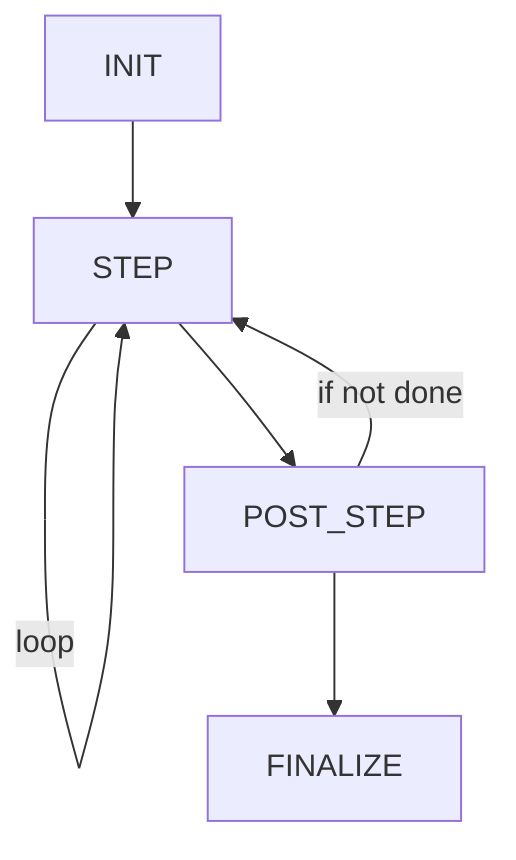
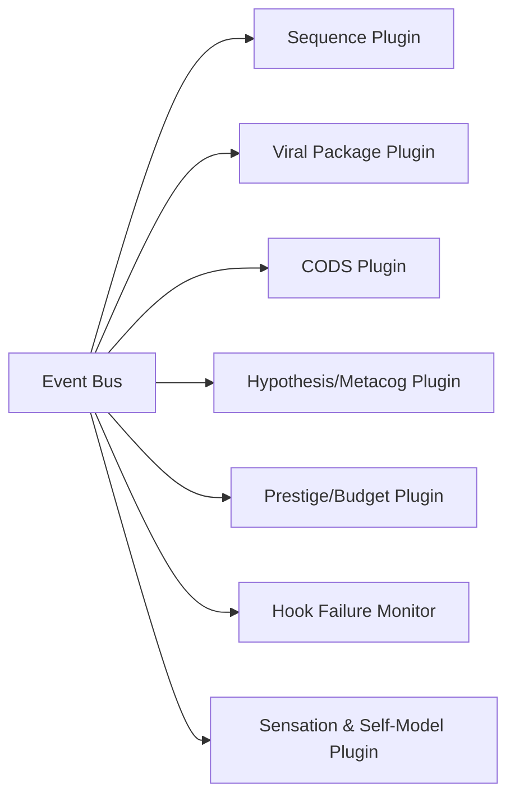
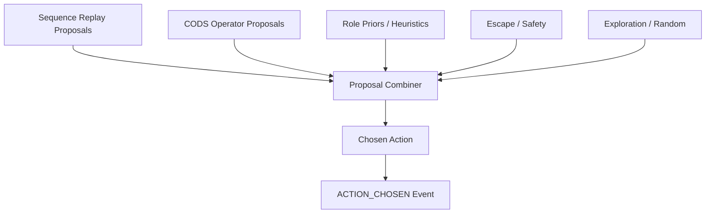
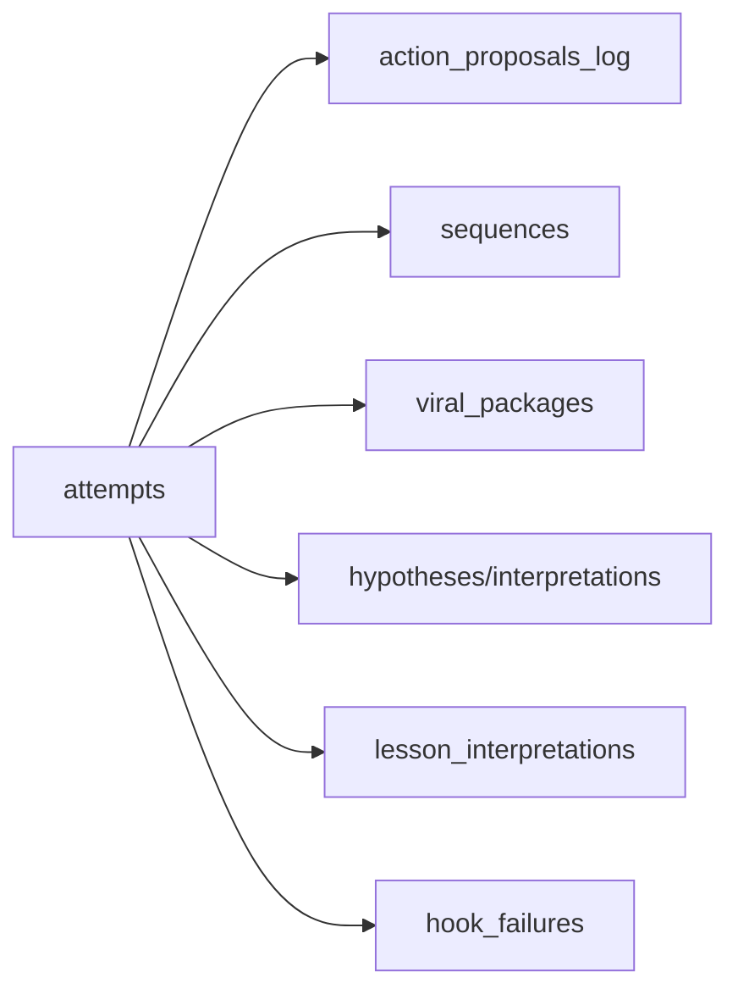
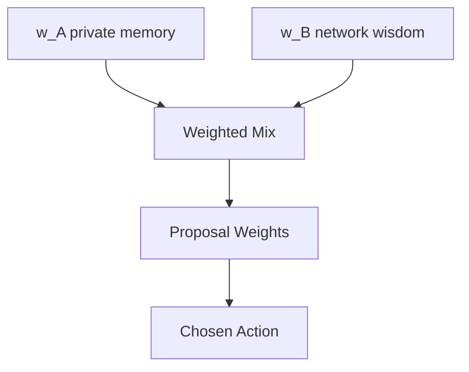
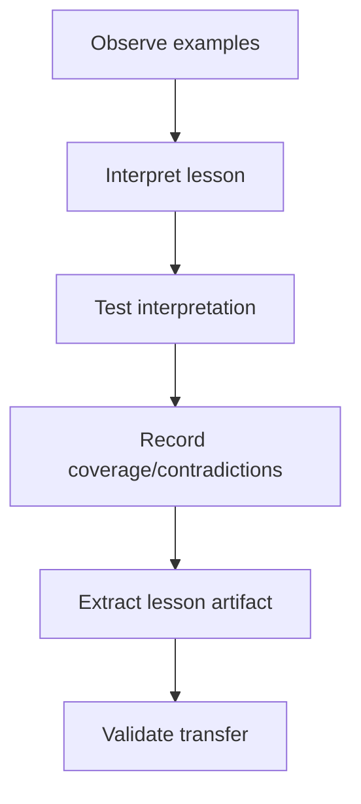

# Architecture Diagrams (Planning)

## Runtime Flow (modes enforced, ARC API unchanged)

## Event Bus + Plugins (DB-backed)

## Action Selection Pipeline (proposal combiner)

## Data Lineage (attempt_id is the spine)

## Two-Streams Influence per Decision

## Games-as-Teachers (lesson-centric logging)

