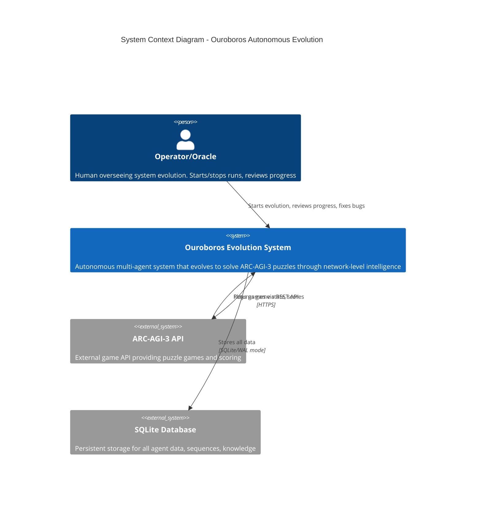

# C4 Context Diagram - Ouroboros System

## System Context Level

This diagram shows the Ouroboros autonomous evolution system and its external interactions.

## Context Description

### The Ouroboros System
- **Purpose**: Achieve 100% win rate on all ARC-AGI-3 puzzle games through autonomous network-level evolution
- **Philosophy**: "The database is the organism" - agents are temporary vessels, knowledge persists
- **Mode**: Fully autonomous with optional operator oversight

### External Systems

| System | Purpose | Interaction |
|--------|---------|-------------|
| **ARC-AGI-3 API** | Provides puzzle games with levels, frames, actions 1-7 | Agents play real games, never simulated |
| **SQLite Database** | Persistent storage (~10 GB limit) | 73+ tables storing everything |

### Key Actors

| Actor | Role | Interactions |
|-------|------|--------------|
| **Operator/Oracle** | Autonomous oversight (Claude/Copilot) | Monitors health, fixes bugs, commits changes |

## Architecture Principles

1. **Database-Only Storage**: All data in SQLite, never log files
2. **Real Games Only**: Never mock/simulate - always use ARC API
3. **Network-Centric**: Knowledge belongs to network, not individual agents
4. **Prestige/Budget Separation**: Social capital (prestige) separate from economic capital (action budgets)
5. **No Unicode Emojis**: ASCII only for Windows compatibility
